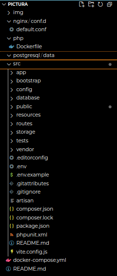

# PICTURA
### Tugas Docker untuk Aplikasi Sharing Picture
### Mata Kuliah Teknologi Berbasis Cloud

##### Anggota Kelompok :
##### 1. Achmed Hibatillah
##### 2. Kevin Josua

### Struktur Direktori

- Direktori `nginx/conf.d` digunakan untuk menyimpan konfigurasi nginx, yakni dalam bentuk file `default.conf`.
- Direktori php digunakan untuk menyimpan `Dockerfile` yang akan membuat membuat image PHP-FPM 8.2.11 yang sudah terpasang Composer, ekstensi PDO untuk MySQL dan PostgreSQL, serta berbagai library dan tools penting untuk menjalankan aplikasi PHP dengan dukungan database Postgres.
- Direktori src digunakan untuk menyimpan aplikasi Laravel.

### Docker Compose
- `app`: Membangun dan menjalankan container PHP-FPM untuk aplikasi Laravel dari folder ./php dengan kode sumber di ./src.
- `db`: Menjalankan container PostgreSQL dengan data persisten di ./postgresql/data dan konfigurasi user/password untuk database blog.
- `nginx`: Menjalankan server web Nginx yang melayani aplikasi PHP di port 8081, menggunakan konfigurasi dan kode dari folder lokal.
- `pgadmin`: Menyediakan interface web pgAdmin di port 5050 untuk mengelola database PostgreSQL secara visual.

### Langkah
- Build docker compose: 
`docker compose build`
- Masuk ke container Laravel: 
`docker exec -it blog bash`
- Menjalankan migrasi: 
`php artisan migrate`
- Keluar container laravel: 
`exit`
- Jalankan docker compose: 
`docker compose up`